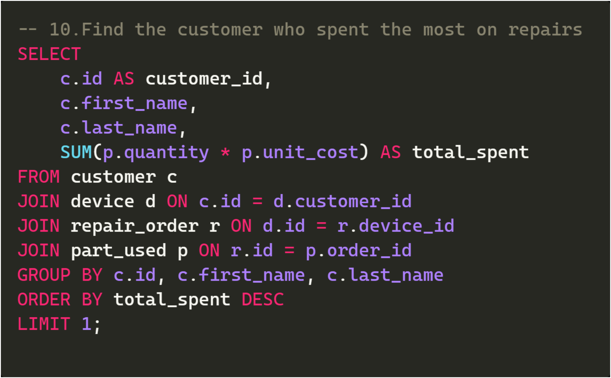
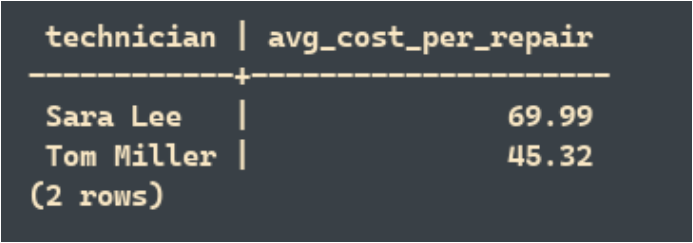

# Tech Repair Shop Database Project

A relational database project modeled for a fictional tech repair business. Designed in PostgreSQL, this project demonstrates key database concepts including normalization, security, triggers, role-based access, and analytics queries.

---

## 🔹 Project Scope
This project meets the following SQL objectives:
- **Data normalization** (3NF: separate customers, devices, orders, etc.)
- **User roles & security** with login restrictions and row-level policies
- **Constraints** including PKs, FKs, `CHECK`, and `UNIQUE`
- **Trigger-based automation** for timestamps
- **Aggregate queries** to support reporting and insights
- **Maintenance logic** via vacuuming and reindexing
- **ACID-aware design** (e.g. safe updates, FK enforcement)

---

## 📅 Use Case: Tech Repair Store
- Customers bring electronics for service
- Devices are tied to customer records
- Repairs are handled by technicians
- Parts used per repair are tracked
- Role-based system controls technician, admin, and auditor permissions

---

## 📑 Schema Overview
Each table is designed with purpose and integrity in mind:

| Table        | Description                                             |
|--------------|---------------------------------------------------------|
| `customer`   | Stores contact info and identity                        |
| `device`     | Links devices to customers with serial and status info |
| `repair_order` | Tracks issues, resolutions, and assigned technicians  |
| `part_used`  | Tracks part name, quantity, and unit cost              |
| `technician` | Stores staff contact info                              |
| `user_role`  | Login-based access and permission control              |

> See: 

---

## 🔐 Roles & Permissions
### Login Roles
- `tech_login` → Basic tech access (limited RLS view)
- `admin_login` → Full CRUD access across all tables
- `auditor_login` → Read-only access

### Row-Level Security (RLS)
- Enabled on `user_role`
- Techs can only read/update their own rows
- Admins are exempt from RLS restrictions

  
📂 View SQL snippets for Roles & Permissions

  

---

  

---

  

---

## 📋 Trigger Automation
Two trigger functions simplify timestamp management:

- `set_timestamp()` → Updates `updated_at` before every row change
- `set_closed_timestamp()` → Automatically fills `closed_at` when a repair is marked 'Closed'

Trigger scripts are in `trigger_creation.sql`

  
📂 View SQL trigger creation snippets

  

---

  

---

## 🔢 Indexed Performance
PostgreSQL indexes added for speed and searchability:
- Email, phone on `customer`
- Status on `repair_order`
- Serial number on `device`
- Composite index on `(technician_id, status)`
- Full-text GIN indexes on `model` and `issue_description`

  
📂 View SQL index & maintenance function snippets

  
  
---

  

---

  

---

## 🔤 Query Demonstrations
Twelve sample queries were written and tested to demonstrate insights, reporting, and relational joins. Topics include:
- Devices per customer
- Parts and cost per repair
- Most used parts
- Technicians with most repairs
- Average repair cost by technician

Each query is saved in `queries.sql` and visually shown in:
## 🧪 Query Demonstrations

Below are examples of real SQL queries and the results they return.

  
📂 View queries and results

  
🔠Query 1: Get all customers

  **SQL to list all customers:**

  

  **Result set for all customers:**

  

  

  
🔠Query 2: Get devices for customer #1

  **SQL to find devices for customer ID 1:**

  

  **Result showing devices owned by customer 1:**

  

  
🔠Query 3: List all open repair orders

  **SQL to list open repair orders:**

  

  **Result set showing open repairs:**

  

  
🔠Query 4: List customer names with their devices

  **SQL to join customers and their devices:**

  

  **Result showing each customer’s device info:**

  

  
🔠Query 5: Get repair orders with tech & device info

  **SQL to join repair orders, devices, and technicians:**

  

  **Result showing detailed repair info:**

  

  
🔠Query 6: Show parts used in each repair order

  **SQL to show parts used per repair:**

  

  **Result showing parts and costs:**

  

🔠Query 7: Count how many devices each customer owns

**[SQL to count devices per customer]**  
  

**[Result set showing total devices per customer]**  
  

🔠Query 8: Get total repair cost per order

**[SQL to calculate total cost of repairs]**  
  

**[Result set showing total cost per order]**  
  

 
🔠Query 9: List all repairs completed by each technician

  
🔠Query 10: Customer who spent the most on repairs

  **SQL to find the top-spending customer:**

  

  **Result showing the customer who spent the most:**

  

  
🔠Query 11: Avg. repair cost per technician (Closed only)

  **SQL to calculate average cost per technician:**

  

  **Result showing average repair cost per tech:**

  

  
🔠Query 12: Show all non-Closed repair orders

  **SQL to display open and in-progress repair orders:**

  

  **Result showing repair orders that are not closed:**

  

---

## 📂 SQL Scripts Included
All database logic is broken out cleanly in:
- `table_creation.sql`
- `trigger_creation.sql`
- `roles.sql`
- `seed_data.sql`
- `queries.sql`
- `indexes.sql`

---

## 📅 Testing & Sample Data
20+ rows of realistic dummy data were inserted for testing devices, repairs, tech assignments, and repair parts. This enabled testing of joins, aggregation, filters, and policy enforcement.

See: `seed_data.sql`

---

